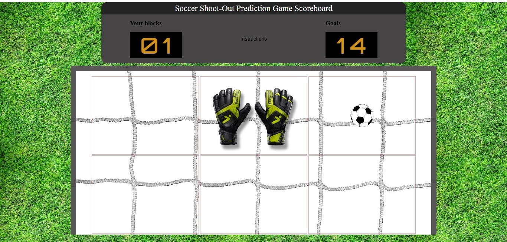

# Shootout-Prediction-Game

## Link to game: https://eugenehan94.github.io/Shootout-Prediction-Game/

A 2D soccer shootout game, where the use is the goalkeeper and the computer is the shooter.
This game was created using HTML, CSS and vanilla Javascript.

INSTRUCTIONS: The user selects one the six quadrants of the net to protect and
the computer would randomly choose a region as well. The players choice will be marked by
a pair of goalkeeper gloves and the computer's choice a soccer ball. If the user selects the
same quadrant this would be a block, else it would be considered a goal. The results would
be reflected in the score board.

## Screenshot of game

